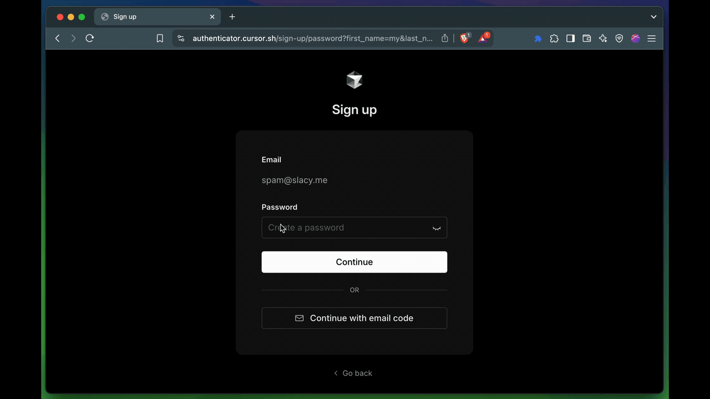
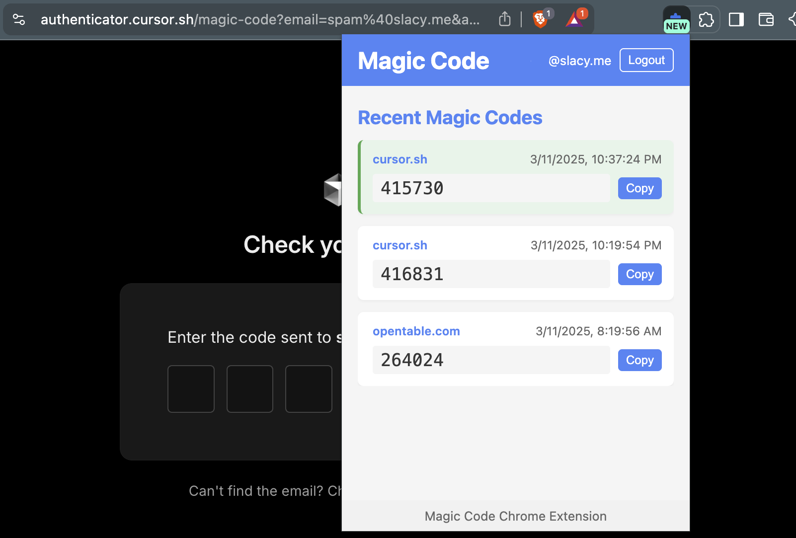

# magic code 🪄 ✨
> I was signing up for [cursor.com](https://cursor.com) but didn't want to open my email to verify my account so I asked Claude code to make an extension to do it for me

See it in action:

> [!WARNING]  
> Claude went on a bender here, the code is _BAD_   The server/index.ts is 1121 lines long when it could be less than 500   The extension folder is scary

### What it does:
- Sign in with Google
- Scans for new unread emails
- Checks to see if they contain a verification code or link
- Adds to the extension
- Opens the extension if the code is new
- Copies the code to the clipboard

### What it doesn't do (yet 🤞):
- Automatically paste the code into the input field like iOS
- Automatically submit the form
- Use google pubsub instead of polling

</img>

